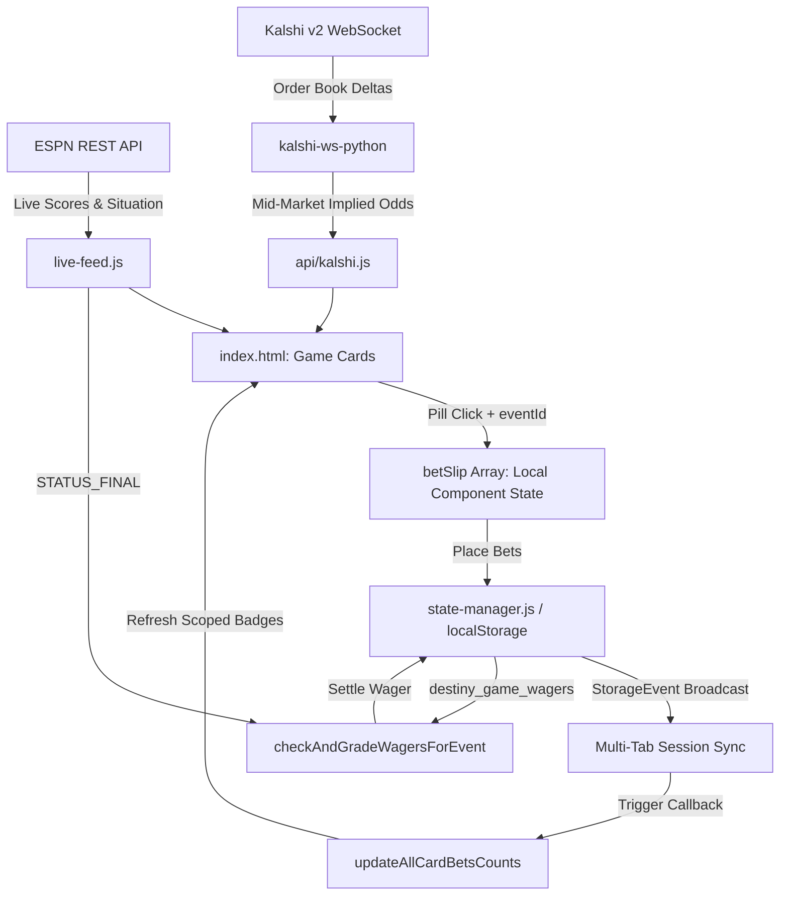

# Destiny Sports Command Center — System Architecture & Technical Specification

## 1. System Overview

**Destiny Sports Command Center** is a real-time sports analytics, odds monitoring, and paper-trading betslip execution engine. The platform ingests live game scores, play-by-play situations, and orderbook odds across major sports leagues (NFL, NBA, MLB, NCAA), calculates implied market probabilities, and manages active wager lifecycles with automated score-based settlement.

### Core Technology Stack
- **Frontend Runtime**: Native JavaScript (ES6+), HTML5, CSS3 with Custom CSS Variables (Theme System).
- **State Persistence**: Synchronous `localStorage` backed by `state-manager.js` with pub/sub state synchronization across multi-tab sessions via native `StorageEvent`.
- **Data Ingestion**: 
  - **Live Scores & Play-by-Play**: ESPN Public REST APIs polled via `live-feed.js` (with Page Visibility API throttling and exponential backoff).
  - **Live Odds & Order Books**: Kalshi Trade API v2 (REST + WebSockets via Python `kalshi-ws-python` microservice) with fallback to ESPN odds metadata.
- **Odds Conversion & Math**: Cent-to-American odds converter ($P > 0.50 \Rightarrow -\frac{P}{1-P} \cdot 100$, $P < 0.50 \Rightarrow +\frac{1-P}{P} \cdot 100$), Parlay probability multiplier, Teaser point adjustment matrix (-6.0 to +7.5 pts).
- **Deployment Model**: Decoupled static web application hostable on GitHub Pages / Vercel / Nginx, with an optional Python asyncio backend sidecar for Kalshi WebSocket orderbook streaming.

---

## 2. Directory & Module Structure

```text
destiny-sports-command-center/
├── index.html                   # Primary Single-Page Application (SPA) dashboard
├── state-manager.js             # Global state controller (Bankroll, Wagers, Settings)
├── live-feed.js                 # ESPN Live Score & Situational Polling Engine
├── nav.js                       # Navigation bar & global drawer controller
├── theme.css                    # Unified design tokens, color palette & typography
├── ARCHITECTURE.md              # Architectural specification & developer guide
├── PROJECT_OVERVIEW.md          # Functional requirements & sitemap documentation
│
├── api/                         # Backend API wrappers & odds fetchers
│   ├── kalshi.js                # Kalshi REST API market resolver & odds provider
│   ├── kalshi-props.js          # Kalshi Player/Team prop market query module
│   ├── kalshi-history.js        # Kalshi historical odds timeline query engine
│   ├── odds.js                  # Consensus sportsbook odds aggregator
│   └── results.js               # Final score & outcome verifier
│
├── kalshi-ws-python/            # Python WebSocket Market Ingestion Engine
│   ├── main.py                  # Orchestrator & CLI entrypoint
│   ├── auth.py                  # RSA-SHA256 Signer for Kalshi v2 Auth
│   ├── market_resolver.py       # Multi-Prop Market Discovery (Game Lines, Props, Periods)
│   ├── ws_client.py             # Resilient WebSocket Client (Async Queue, Code 25 prevention)
│   ├── book_state.py            # In-Memory L2 Orderbook State & Implied Probabilities
│   ├── connection_manager.py    # Auto-Reconnect & Heartbeat Manager
│   └── test_engine.py           # Unit & Integration Test Suite (11 passing tests)
│
├── my-bets.html                 # Dedicated Active & Historical Wager Management View
├── bet-slip.html                # Standalone Betslip & Parlay Builder
├── bet-history.html             # Graded Wager Performance & Analytics Ledger
├── results.html                 # Game Score Archive & Cover Margin Database
├── line-tracker.html            # Historical Line Movement Timeline Charting
├── portfolio.html               # Bankroll Performance & Risk Metrics Dashboard
├── props.html                   # Multi-Prop Odds Grid & Matrix Search
├── history.html                 # Historical Odds Timeline & Visualizer
└── sandbox.html                 # Experimental UI & Widget Sandbox
```

---

## 3. Data Flow & State Management



### Global vs. Local State Patterns
1. **Local Selection State (`betSlip`)**:
   - Holds transient selections in memory prior to placement.
   - Each item stores: `id`, `team`, `type`, `odds`, `matchup`, `eventId`, `wager`, `toWin`.
2. **Global Ledger State (`destiny_game_wagers`)**:
   - Managed via `state-manager.js` and persisted synchronously to `localStorage`.
   - Stores active (`PENDING`) and settled (`WON`, `LOST`, `PUSH`) wager tickets.
3. **Bankroll & Debt Token State (`destiny_bankroll`, `destiny_debt_tokens`)**:
   - $1,000,000.00 initial default bankroll.
   - Wager placement subtracts risk stake. If bankroll < total stake, user is prompted to issue **Crypto Debt Tokens (DEBT)** to cover the deficit.
   - Graded `WON` wagers credit `Stake + ToWin` back to bankroll; `PUSH` wagers refund 100% of `Stake`.

### Multi-Tab State Synchronization (`StorageEvent`)
`state-manager.js` registers a global listener for browser `StorageEvent` instances across open windows/tabs:
```javascript
window.addEventListener('storage', (event) => {
    if (['destiny_game_wagers', 'destiny_bankroll', 'destiny_debt_tokens'].includes(event.key)) {
        // Broadcast updates to all registered UI subscribers
        updateBankrollDisplay();
        updateActiveBetsCountGlobal();
        if (typeof updateAllCardBetsCounts === 'function') {
            updateAllCardBetsCounts();
        }
        if (typeof renderActiveBetsInPanel === 'function') {
            renderActiveBetsInPanel();
        }
    }
});
```
- **Operational Detail**: When a wager is placed or graded in a standalone view (such as `bet-slip.html` or `my-bets.html`), the modification to `localStorage` triggers an instantaneous `StorageEvent` in all other open browser tabs.
- **No Page Reload Required**: The receiving tabs execute `updateAllCardBetsCounts()` and `renderActiveBetsInPanel()`, dynamically creating, updating, or removing game card `MY BETS` badges in real time.

### Formal JSDoc Type Definitions (`@typedef`)

```javascript
/**
 * Individual leg inside a multi-leg wager or straight bet.
 * @typedef {Object} WagerLeg
 * @property {string} [eventId] - ESPN's unique event identifier (e.g. "401671607").
 * @property {string} matchup - Formatted matchup header string (e.g. "Football - NFL - Patriots vs Seahawks").
 * @property {string} selection - Selected team and line description (e.g. "Patriots +3 (-113)").
 * @property {string} odds - Placed American odds string (e.g. "-113").
 * @property {'PENDING' | 'WON' | 'LOST' | 'PUSH'} status - Leg settlement status.
 */

/**
 * Complete placed wager ticket object.
 * @typedef {Object} WagerTicket
 * @property {string} id - Unique internal ticket ID (e.g. "placed-17890045-1725900000").
 * @property {string} [ticketNumber] - User or bookmaker ticket number (e.g. "994662668").
 * @property {string} [eventId] - Primary ESPN event ID for single-game wagers.
 * @property {Array<string>} [eventIds] - Array of ESPN event IDs for multi-game parlays/teasers.
 * @property {string} matchup - Ticket-level matchup header or "Multi-Matchup Parlay (X Legs)".
 * @property {string} target - Detailed bet summary target string.
 * @property {'GAME' | 'PARLAY' | 'TEASER' | 'PLEASER' | 'IF_BET'} type - Bet category.
 * @property {number} stake - Total risk amount in USD.
 * @property {number} toWin - Potential profit amount in USD.
 * @property {string} placedOdds - Placed American odds or parlay multiplier (e.g. "+617").
 * @property {'PENDING' | 'WON' | 'LOST' | 'PUSH'} status - Overall ticket settlement status.
 * @property {Array<WagerLeg>} [legs] - Individual leg details for parlays, teasers, or if-bets.
 * @property {string} [acceptedDate] - ISO timestamp or formatted placement date.
 * @property {string} [settledDate] - ISO timestamp of outcome resolution.
 * @property {number} [settledPayout] - Actual amount credited back to bankroll upon settlement.
 */

/**
 * Live situational data object for in-game card rendering.
 * @typedef {Object} GameCardSituation
 * // Football Situational Fields
 * @property {number} [down] - Current down (1-4).
 * @property {number} [distance] - Yards needed for a first down.
 * @property {number} [yardLine] - Field position yard line (1-100).
 * @property {string} [possessionText] - Team abbreviation possessing the ball (e.g. "NE").
 * // Baseball Situational Fields
 * @property {number} [outs] - Current out count (0-2).
 * @property {boolean} [onFirst] - Runner present on first base.
 * @property {boolean} [onSecond] - Runner present on second base.
 * @property {boolean} [onThird] - Runner present on third base.
 * @property {string} [batter] - Active batter name.
 * @property {string} [pitcher] - Active pitcher name.
 */
```

---

## 4. Key Domain Logic

### 1. Wager-to-Game Matching Logic
To eliminate brittleness caused by team name variations (e.g., "LA Clippers" vs "Los Angeles Clippers"), wagers are matched using a two-tier hierarchy:
1. **Primary Unique ID Matching (`eventId`)**:
   - Compares ESPN’s unique event ID (`event.id`) against `wager.eventId`, `wager.eventIds`, and `leg.eventId`.
   - Matching rule: `String(wager.eventId) === String(espnEvent.id)`.
2. **Secondary String Parsing Fallback**:
   - Used only if `eventId` is absent (legacy/manual tickets).
   - Extracts team abbreviations and clean mascot names.
   - Excludes generic location and sports stop-words:
     `['new', 'york', 'los', 'angeles', 'san', 'diego', 'francisco', 'jose', 'bay', 'green', 'kansas', 'city', 'st.', 'st', 'louis', 'north', 'south', 'east', 'west', 'the', 'and', 'for', 'game', 'over', 'under', 'team', 'total', 'state', 'real', 'fc', 'football', 'basketball', 'baseball', 'parlay', 'teaser']`

### 2. Multi-Matchup Parlay Ticket Headers
For multi-leg parlays spanning distinct games:
- **Header Banner**: If `uniqueLegMatchups.length > 1`, top-level header displays `Multi-Matchup Parlay (X Legs)`. If all legs share one matchup, displays `${matchupName}`.
- **Leg-Level Context**: Each leg card inside the ticket explicitly renders its own `📍 MATCHUP: ${leg.matchup}` tag.

### 3. Core Card Component Lifecycle & `MY BETS` Badge Display Conditions
- **Card Rendering**: `renderCard(event, lg, panelType)` calculates live game situation graphics (down & distance for football, bases/outs for baseball), weather/dome badges, and dynamic odds pills.
- **Badge Display Condition**:
  - `getWagersForGame(eventId, awayAbbr, awayName, homeAbbr, homeName)` returns active wagers strictly matching `eventId`.
  - The `<button class="card-my-bets-btn">` badge is rendered **only if `betsCount > 0`**.
  - If `betsCount === 0`, the badge element is **omitted from the DOM** (or removed during dynamic DOM updates in `updateAllCardBetsCounts`).

### 4. PUSH Handling & Settlement Rules
- **Line Ties**: If a spread or total lands exactly on the line (e.g. `Ravens -3` winning 27-24, or combined score = 44.0 on `O/U 44`):
  - Leg status evaluates to `PUSH` (`➔ PUSH`).
  - **Straight Bet**: Wager status settles to `PUSH`, and 100% of risk stake is credited back to bankroll.
  - **Multi-Leg Parlay**: Pushed leg drops out without failing the parlay. Remaining winning legs calculate a reduced payout:
    $$\text{Payout} = \text{Stake} + \left(\text{ToWin} \times \frac{\text{WonLegs}}{\text{TotalLegs}}\right)$$
  - **All-Leg Push**: If all legs push, 100% of stake is refunded.

---

## 5. API & External Integrations

### External Data Providers
1. **ESPN REST API**:
   - Endpoints: `GET https://site.api.espn.com/apis/site/v2/sports/{sport}/{league}/scoreboard`
   - Default Polling Interval: `5,000ms` via `live-feed.js`.
   - Schema mapping:
     - `event.id`: Unique game identifier (`String`).
     - `status.type.name`: Game state (`STATUS_SCHEDULED`, `STATUS_IN_PROGRESS`, `STATUS_FINAL`, `STATUS_FULL_TIME`).
     - `competitions[0].competitors`: Team scores, records, logos, home/away designation.
     - `competitions[0].situation`: Live down, distance, yard line, possession team, base runners, outs (`GameCardSituation`).

2. **Kalshi Trade API v2 (WebSockets & REST)**:
   - Base URL: `https://api.elections.kalshi.com/trade-api/v2`
   - Authentication: RSA-SHA256 signature (`auth.py`).
   - Discovery: `GET /events/{event_ticker}` -> categorizes markets into `game_lines`, `player_props`, `team_props`, `period_lines`.
   - Real-Time Subscription Payload:
     ```json
     {
       "id": 1,
       "cmd": "subscribe",
       "params": {
         "channels": ["ticker", "orderbook_delta"],
         "market_tickers": ["KXNFL-26SEP09-NE-WIN", "KXNFL-26SEP09-NE-SPREAD-3"]
       }
     }
     ```

### API Resilience, Tab Dormancy & Rate Limiting (`live-feed.js`)
To prevent client CPU drain, unnecessary network bandwidth consumption, and HTTP rate limiting, `live-feed.js` implements three resiliency policies:

1. **Tab Dormancy Throttling (Page Visibility API)**:
   - Listens to `document.addEventListener('visibilitychange', ...)`:
     ```javascript
     document.addEventListener('visibilitychange', () => {
         if (document.hidden) {
             pausePollingInterval(); // Pause 5,000ms timer while tab is backgrounded
         } else {
             resumePollingInterval(); // Instantly trigger fetch and resume 5,000ms timer
         }
     });
     ```
   - When the user switches to another browser tab or minimizes the window (`document.hidden === true`), background polling is paused or throttled to 60,000ms. Upon refocusing the tab, an immediate fetch is dispatched.

2. **Exponential Backoff Retry Strategy**:
   - On network drop (`TypeError: Failed to fetch`) or HTTP error status (`429 Too Many Requests`, `5xx Server Errors`):
     - The polling interval $t$ escalates exponentially from the default $5,000\text{ms}$:
       $$t_{n+1} = \min\Big(t_n \times 2, \; 60000\text{ms}\Big)$$
     - Retry escalation progression: $5\text{s} \longrightarrow 10\text{s} \longrightarrow 20\text{s} \longrightarrow 40\text{s} \longrightarrow 60\text{s} \text{ (Max Cap)}$.
     - Upon the first successful `HTTP 200 OK` response, the backoff state automatically resets back to $5,000\text{ms}$.

3. **Fallback Payload Graceful Degradation**:
   - If live API connections fail completely, game cards gracefully fallback to cached scoreboard objects in `localStorage.espn_events_cache` without blanking out the UI or throwing unhandled JavaScript exceptions.

---

## 6. Maintenance & Extension Guidelines

### Adding New Betting Markets or Sport Feeds
1. **Register League Schema**:
   - In `live-feed.js`, add the new league descriptor (e.g., `{ id: 'nhl', sport: 'hockey', league: 'nhl', name: 'NHL' }`) to `SUPPORTED_LEAGUES`.
2. **Implement Sport Graphic Component**:
   - In `renderCard`, create a situational renderer function (e.g. `renderHockeyGraphic(sit, away, home)`) matching ESPN's `situation` payload.
3. **Extend Market Resolvers**:
   - In `market_resolver.py` (Kalshi WS engine), add ticker resolution regexes for period lines (e.g. 1st Period, 2nd Period) and player props (e.g. Shots on Goal, Saves).

### Scoping Invariants (Preventing State Bleed)
- **Always Pass `event.id`**: When building interactive UI elements (odds pills, action buttons, modals), pass `event.id` alongside display strings.
- **Never Query Global Arrays Directly in Cards**: Game cards must call `getWagersForGame(eventId, ...)` rather than inspecting raw `localStorage` without `eventId` filtering.
- **Strict Conditional DOM Removal**: If a badge or counter evaluates to `0`, explicitly remove the element (`element.remove()`) or omit it from the template string to avoid stale UI artifacts.
